[](https://classroom.github.com/a/PVVlivbu)
[](https://classroom.github.com/open-in-codespaces?assignment_repo_id=23493228)
# Homework - Alaska Search 🔍🗺️📌🕵️✈️

Topics: BFS, DFS, and A*

## Part 0 - Pre-req

The code uses the NetworkX library [networkx.org](https://networkx.org/) for graph generation and rendering. Documentation can be found [here](https://networkx.org/documentation/stable/tutorial.html). It also uses pandas and cartopy. To install, use the command:

```bash
pip install networkx numpy matplotlib pandas cartopy
```

and follow any instructions. Some people have had experiences where pip is not installed. You can find instructions for your environment here [https://pip.pypa.io/en/stable/installation/](https://pip.pypa.io/en/stable/installation/).
You can find a basic overview of using networkx with matplotlib here: https://www.geeksforgeeks.org/python/python-visualize-graphs-generated-in-networkx-using-matplotlib/. 

Note: Last I checked May 1, if you use the Python Debugger, use an older version of Python3 before Python 3.13.3. There's a bug that causes the debugger to crash. You can set up a virtual environment.

## Part 1 - Overview

This assignment is meant to ensure that you:

* Understand the concepts of uninformed and informed search
* Can utilize NetworkX to traverse a graph along edges

* Experience with different search algorithms
* Are able to visualize graphs
* Can argue for choosing one algorithm over another in different contexts

This assignment will provide the following map of airports:

[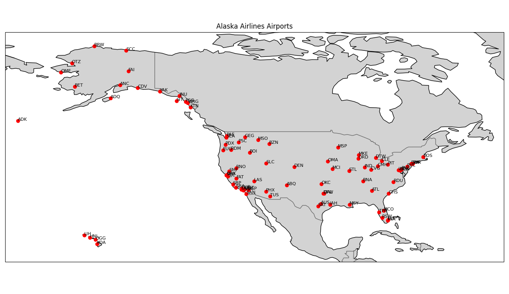](airports.png)

This isn't actually an image but a rendering of real data from [OurAirports.com](https://ourairports.com/data/) and the [United States Department of Transportation](https://www.transtats.bts.gov/DL_SelectFields.aspx?gnoyr_VQ=FGJ&QO_fu146_anzr=b0-gvzr) for Alaska Airlines in January 2025. Cleaned versions of these datasets are given in [airport_codes.csv](airport_codes.csv) and [as.csv](as.csv) respectively.

Your task is to write a program that will ultimately ask the user for a starting and ending destinations then search to find the route that connects them (if one exists). It will find three different paths using BFS, DFS, and A* between those locations. Do not worry about timing routes or directionality. For the purposes of this assignment, if two cities have a flight then they are connected irrespective of direction or time.


You will update the [alaska.py](alaska.py) file to:

1. Utilize Breath-First-Search, Depth-First Search, and A* Search algorithms built into NetworkX.
2. Simplify the outputs of the bfs and dfs searches to stop searching once the destination has been reached.
3. Write functions to visualize the searches on a given graph and save the images to display in the README.
4. Answer the questions in the reflection.

---


## Part 2 - Adding and Drawing Edges

*Imporant*: Please visit [NetworkX's documentation](https://networkx.org/documentation/stable/tutorial.html) for lots of additional resources and examples.

The first step that you will have to do is connect the nodes in the graph. The provided example code does not load in edges between nodes. To do that, you will need to connect them. If there are multiple flights between two cities, count that as a single edge.

1. Add edges for each flight stored in flight, and their weight (distance). The data has already been cleaned for you.
[NetworkX edges](https://networkx.org/documentation/stable/tutorial.html#edges)
You can use list(G.edges) to ascertain whether you have added them. For calculating the weight/heuristic _h(x)_ using  distance, you can use the Euclidean distance between coordinates or a Haversine function like the one found here: https://pypi.org/project/haversine/. 

2. (Optional) Save your graph so you can load it, rather than redraw it every single time. https://networkx.org/documentation/stable/reference/readwrite/graphml.html 

3. For each search query in the next section, draw the edges that were visited as part of your search; do not include the entire search space. Remember that the weights/cost on each edge, is the distance between the nodes. Color-code the routes to identify when your search covers edges, and to identify the final path. https://networkx.org/documentation/stable/reference/generated/networkx.drawing.nx_pylab.draw_networkx_edges.html#draw-networkx-edges  

4. Test your code to verify there is a connecting flight from Seattle to Boston.

Do not use destination as coordinates, because humans do not remember latitude and longitude very well. Instead use city names or airport codes. 

Below is an example screenshot drawing a graph with different colored edges given the following code:

```python
    # add main code here
    G = nx.balanced_tree(5,2)
    source = 0
    target = 9
    bfs = mybfs(G, source, target)
    print(bfs)
    colors = ['red' if edge in bfs else 'blue' for edge in G.edges()]
    markers = ['green' if node in [source,target] else 'blue' for node in G.nodes()]
    nx.draw(G, edge_color = colors, node_color = markers, with_labels=True)
    plt.savefig("example_bfs.png") #or use plt.show() to display
```

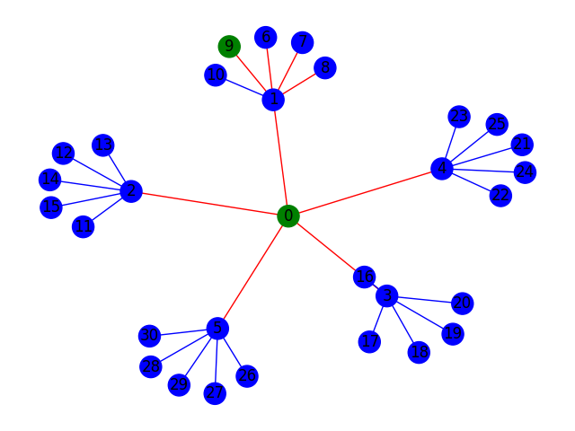

And to visualize a weighted graph edit the following code:

```python
    G = nx.gnm_random_graph(15, 32, seed=0)
    random.seed(0)
    for (u,v) in G.edges():
        G.edges[u,v]['weight'] = random.randint(1,42)
    pos=nx.circular_layout(G)
    nx.draw_networkx(G,pos)
    labels = nx.get_edge_attributes(G,'weight')
    nx.draw_networkx_edge_labels(G,pos,edge_labels=labels)
    plt.savefig("example_astar.png")
```

It creates the following image:

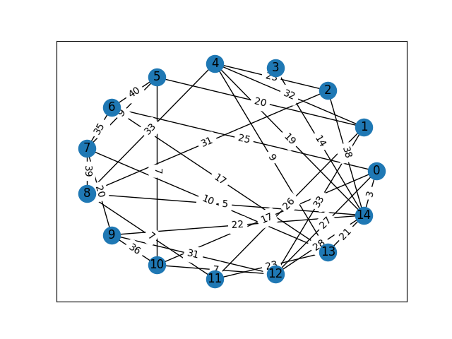


## Part 3 - Generated Images

The images that you generate need to show all of the edges that were searched as part of the algorithm (except for A* since the built-in only gives the final path), but also clearly identify the final path generated by the search algorithm. Below each section, add three clearly labeled images showing the results of the prompted routes. Inside of each image plot, add a footnote (or figure text or title or something similar) that shows the final total distance (counting up the distance for each stop) of the resulting path.

Note that the output of the networkX BFS and DFS functions contain all nodes searched in order of searching them.

### Connect Miami (MIA) to Adak Island (ADK)

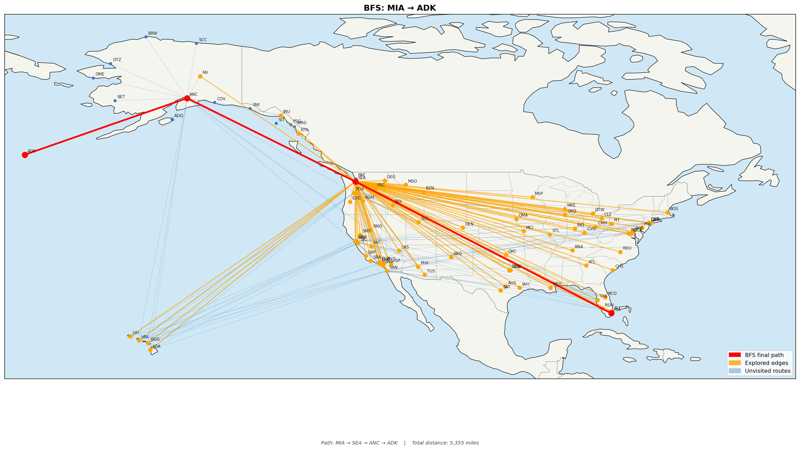

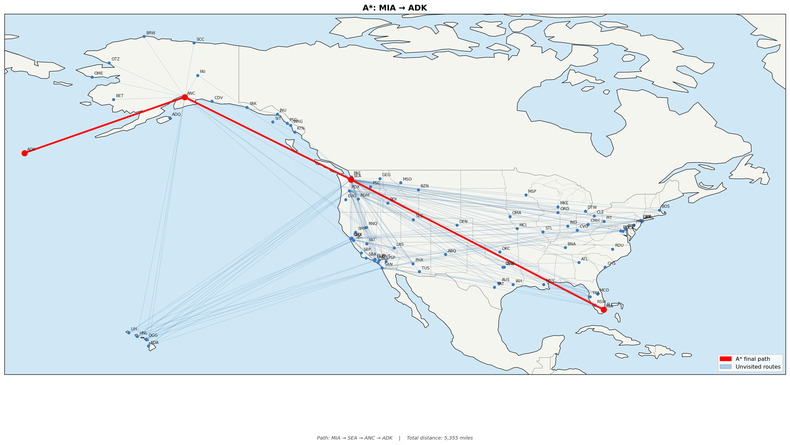

### Nashville (BNA) to Cincinnati (CVG)

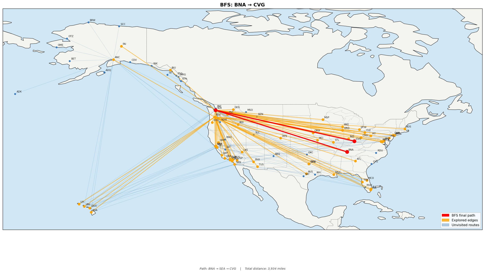
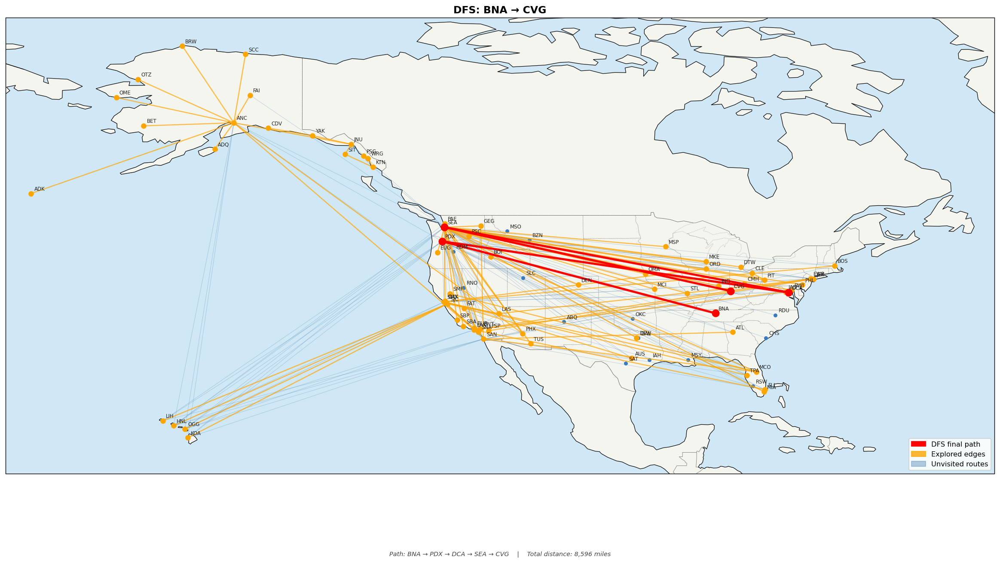
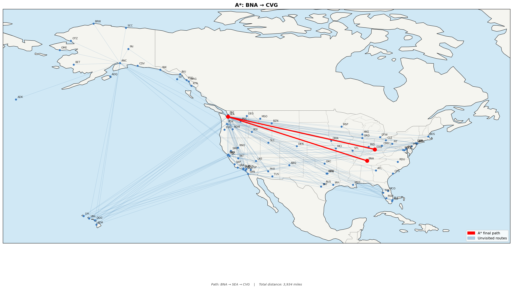

## Part 4 - Reflection

Update the README to answer the following questions:

1. What was this experience like programming with location data and airport codes? Was this something that you had done before?
Ans. This was my first time working with geographical data and sirport codes in a programming context. The most interesting part was to bridge the gap or map the locations from the raw csv file to visualize it, mapping the codes to co-ordinates.

2. I asked ChatGPT "Does it make sense to use BFS on a Binary Search Tree?" ... it responded with:

    ```text
    It can make sense to use Breadth-first search (BFS) on a Binary Search Tree (BST) in certain situations. One of those situations is when we need to traverse the entire tree level by level, for example, printing all the elements of the tree level by level. The output will be sorted since it is a binary search tree.

    Another example of using BFS on a BST is when we want to find the shortest path between two nodes. Since a BST has the property of being ordered, the shortest path between two nodes is the path that goes through the least number of levels. Since BFS visits the nodes level by level, it will find the shortest path between the two nodes.

    However, in most cases, it is more efficient to use the in-order, pre-order, or post-order traversal specific to BSTs, since they are designed to take advantage of the tree's ordered structure.
    ```

    Explain why ChatGPT is completely wrong.
    Ans. 
    a. It claims to bfs on a bst finds the shortest path between nodes,  a bst is a tree, not a general graph, trees have exactly one path between any two nodes, so there's no shortest path to find in bst.
    b. BFS produces a level-order traversal not a sorted order. In order-traversal produces sorted output for a bst not for bfs.These two are completely different traversal orders.
    The only valid use of bfs on a bst would be level- order printing but even ChatGPT's explaination of that is misleading because it conflates level-order with sorted order. 

3. What are at least three things that these search methods not understand when it comes to finding a path from point A to point B on a map using Alaska Airlines? E.g, other constraints, human factors, etc.
Ans. The algorithms don't understand the flight schedules and layover times, the algorithm treat the graph as if you cam instantly transfer between any two connected airports. The algorithms have no concept of time.
It also do not understand the ticket cost, a shorter distance route can easily cost three times more than a longer one. A traveler optimizing for cost would get a completely different path than any of these algorithms produce.
Lastly, passenger preferences and constraints, the algorithms treat all paths as equally valid as long as they connect source to destination. They ignore factors like number of stops, baggage policies, aircraft type, seat availability, accessibility needs,etc..


4. Try reversing directions and going from Adak Island to the Miami. Show your new plots below. Explain why you did or did not get the same resulting paths for each search method.
Ans. DFS has different paths, as dfs depends on the order neighbors are visited at each node which changes completely when you flip the starting point. Since DFS has no concept of optimality, it just follows whichever deep path it encounters first, making it direction-sensitive.

BFS and A* has same paths as they both are optimal algorithms that find the best path regardless of starting direction. Since the graph is undirected with the same edge weights in both directions, the optimal solution from A to B is simply the reverse of the optimal solution from B to A, so flipping the source and destination always yields the same path in reverse.
ADK to MIA
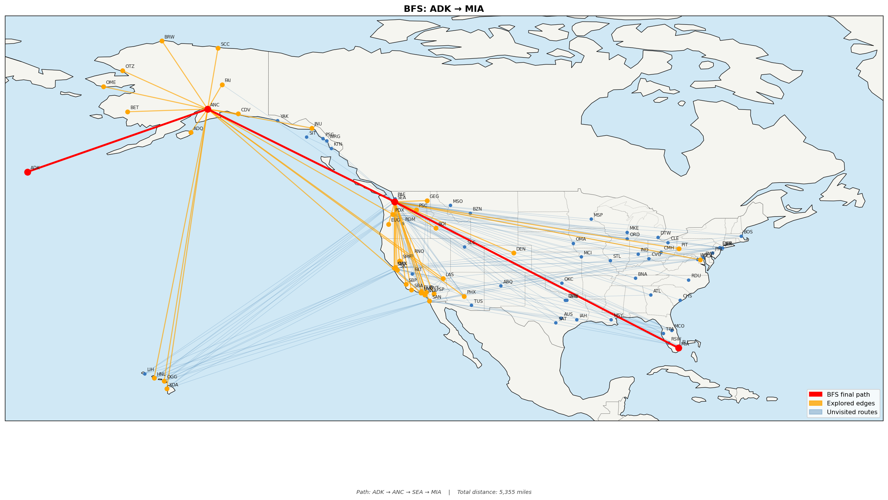
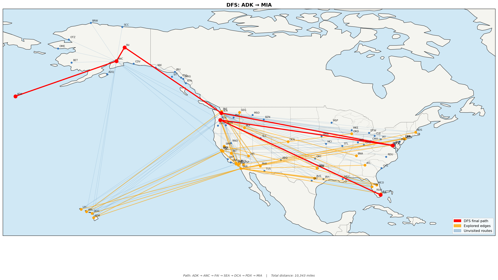
MIA to ADK
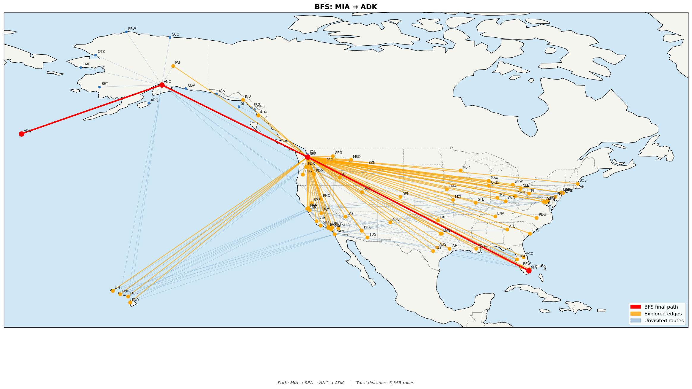
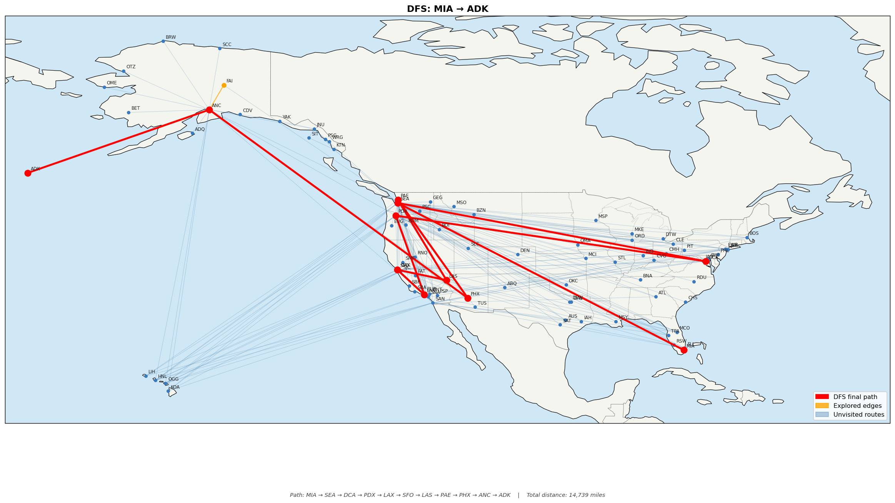
5. What are your thoughts about this homework? Did you find any parts particularly challenging? Lastly, what changes would you make to improve the learning experience for future students?
Ans. This was a well-designed homework, having the dataset ready was really helpufl and the example images were also a great help. 
The most challenging part was visualization- getting cartopy to render correctly, handling the map projections and layering the three edge color to make the difference visible and error than the search algorithms themselves.
For future students improvement: adding a part that asks students to implement their own BFS/DFS from scratch would deepen understanding of how the algorithms actually work rather than just calling library functions.
